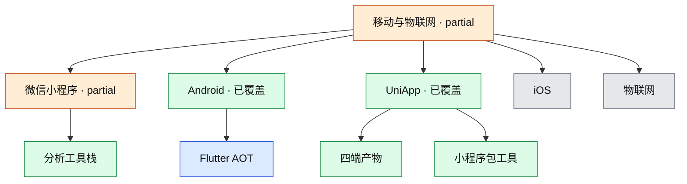

# 移动与物联网安全

当前覆盖：**微信小程序**、**Android Flutter AOT / Blutter**、**UniApp 产物工具地图**（概念）。iOS、物联网协议、Android 权限/组件尚未覆盖。

- 覆盖状态真源：[`coverage.yml`](../../coverage.yml)
- 本领域笔记：
  - [learning/2026-08-17-wechat-miniprogram-local-debug.md](learning/2026-08-17-wechat-miniprogram-local-debug.md)
  - [learning/2026-08-17-wechat-mp-tooling.md](learning/2026-08-17-wechat-mp-tooling.md)
  - [learning/2026-08-17-android-flutter-aot.md](learning/2026-08-17-android-flutter-aot.md)
  - [learning/2026-08-16-uniapp-tooling.md](learning/2026-08-16-uniapp-tooling.md)

## 子图

## 已覆盖

| 节点 id | 深度 | 要点 |
|---|---|---|
| 小程序布局 / 配置 / CLI | practiced | 见本地调试笔记 |
| `mp-tooling` | covered | unveilr / EasyTools / First 等 |
| Android Flutter 各子节点 | practiced / covered | 见 AOT 笔记 |
| `uni-app` 及四端 / www / JS 还原 | concept | KillWxapkg 等与 unveilr 同层；不含解密步骤 |

## 未覆盖（建议顺序）

1. 自有小程序 automator + 测试号
2. 自有未加密 UniApp 演示包对照 `www`
3. First 实践记录
4. 小程序云开发
5. Android 权限、组件导出、网络安全配置
6. iOS

## 与其他领域的边

- 身份认证：wx.login / 业务 token
- 二进制逆向：Flutter ELF、Frida、jadx
- 流量：mitmproxy
