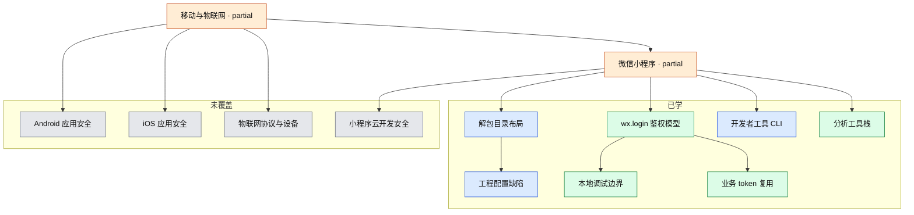

# 移动与物联网安全

当前从**微信小程序本地调试与鉴权模型**切入；Android/iOS 应用安全、物联网协议等尚未覆盖。

- 覆盖状态真源：[`coverage.yml`](../../coverage.yml)
- 本领域笔记：
  - [learning/2026-08-17-wechat-miniprogram-local-debug.md](learning/2026-08-17-wechat-miniprogram-local-debug.md)
  - [learning/2026-08-17-wechat-mp-tooling.md](learning/2026-08-17-wechat-mp-tooling.md)

## 子图

## 已覆盖

| 节点 id | 深度 | 要点 |
|---|---|---|
| `mp-wxapkg-layout` | practiced | 导入 `__APP__`，不是版本根目录 |
| `mp-project-config` | practiced | componentFramework / Skyline lazyCodeLoading / WXML 拆串 / WXS 路径 |
| `mp-wx-login-model` | covered | code 绑定 AppID；后端 AppSecret 换票；业务 token |
| `mp-local-debug-limits` | covered | mock 只过前端门禁 |
| `mp-devtools-cli` | practiced | wechatide 授权调试用途 |
| `mp-auth-token-reuse` | covered | 合法长效 token 可减少反复 wx.login |
| `mp-tooling` 及 unveilr / EasyTools / OpenDevTools / First / wechatide-skill | covered | 产物还原、官方调试、新旧运行时、工作台分层；新版微信 OpenDevTools 不可用 |

## 未覆盖（建议顺序）

1. 自有小程序上的 automator + 测试号实践
2. First 在授权实验室的实践记录（工具已入图谱）
3. 小程序云开发鉴权概念
4. Android 应用基础（APK 结构、权限）

## 与其他领域的边

- 身份认证：`mp-wx-login-model` / `mp-auth-token-reuse` 与 token/session 模型交叉
- 二进制逆向：解包产物分析是「客户端产物」旁支，不是传统 PE/ELF 逆向主线
