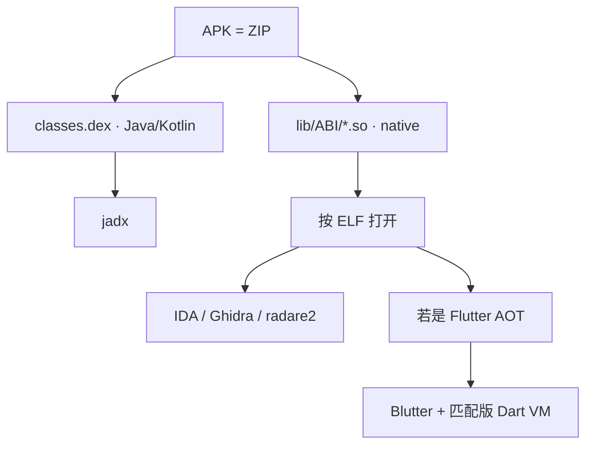

# Android Flutter AOT：APK 分层、ELF、Blutter 与 --obfuscate

合法用途：在**自有或已获授权**的 Android 应用评估里，判断业务在 Java 还是 Flutter AOT，并选用对应静态工具。不涉及破解、绕过授权或未授权访问步骤。

## 学了什么

对一份 Flutter Embedding 2 的 Android 包做文件鉴定与静态代码分析：Java 层几乎是壳，业务在 `libapp.so` 的 Dart AOT / Isolate Snapshot 里。对比了通用 ELF 工具与 Snapshot 专用工具，并弄清 `--obfuscate` 改的是名字而不是字符串本身。

## 可复述结论

### 1. APK 是 ZIP；分析对象按层选工具

- **jadx**：看 Java/Kotlin、四大组件、Flutter Embedding、MethodChannel。若只有壳，不要在 Java 里找业务 API。
- **native `.so`**：Android 上的格式是 **ELF**（Executable and Linkable Format），与 Windows 的 PE、iOS 的 Mach-O 并列。`libapp.so` 常见为 ELF64、aarch64、共享库。
- 通用反汇编看到的是 `.text` 机器码和 `.rodata` 数据。Dart 的类名、函数名、字符串池在 **Isolate Snapshot** 里，对 ELF 解析器往往没有普通 C 字符串那种 xref。

### 2. Flutter Release = 机器码 + Snapshot，不是「源码还在 so 里」

Flutter 把 Dart AOT 打进 `libapp.so` 两块：Snapshot Data（对象池）和 Snapshot Instructions（代码）。  
IDA/Ghidra 当普通 ELF 看时，函数大量匿名、字符串难引用，这是格式问题，不一定是加壳。

**Blutter** 的做法：从 `libflutter.so` 读 Dart 版本，用**同一版本 Dart VM 源码**加载 Snapshot（不跑 App），再 Capstone 反汇编并标注对象池字符串。产出是带符号的汇编（`asm/`、`pp.txt`、`objs.txt`），**不是**原始 `.dart` 源码。

未开混淆时：包路径、类名、JSON 字段名、HTTP 路径会出现在对象池旁的加载指令上，适合还原「客户端调用了哪些接口形状」。  
官方也标明：参数/返回值伪代码、混淆 App、非 arm64 仍是缺口。

工具只记名称与分工：jadx（Java 壳）、Blutter（Snapshot）、IDA/Ghidra/radare2（通用 ELF）。静态结论要用授权环境下的行为或协议观察去验真。

### 3. `--obfuscate` 会变难，但不是加密整包

Flutter `--obfuscate` 主要是**符号改名**（类/库/函数变成短标识）。常与 `--split-debug-info` 一起：对照表在开发者侧，APK 里没有。

| 通常还在 | 通常变差 |
|---|---|
| 写死的 URL 路径、Header 名、JSON 字段名 | `package:...` 与业务类名 |
| 机器码与调用关系 | 按模块理解「这段是哪个功能」 |
| 运行时流量观察 | Blutter 标注质量（官方：混淆 App 会丢函数） |

它不自动清除明文字符串。要提高分析成本还需要别的手段（字符串变换、网络层保护等），那些尚未作为本节点内容。

ELF 本身只是容器：先鉴定「这是 ELF so」，再决定用通用反汇编还是 Snapshot 加载器。

## 实践证据

- **环境**：本机解压授权 APK；`lib/arm64-v8a/libapp.so` + `libflutter.so`；Dart 3.4.4；Blutter 为该版本现编可执行文件。
- **操作**：jadx 确认 Embedding 2 与 Java 壳；按 ELF 打开 so（通用工具字符串 xref 弱）；Blutter 导出带 `package:` 路径与对象池字符串的汇编。
- **结果**：业务归属从「Java」修正为「Dart AOT」；接口形状来自 Snapshot 标注，再用授权环境下的协议观察核对字段与错误码。Ghidra 脚本未作为成功路径。

## 仍未覆盖

- Android 权限、组件导出、证书固定、加固/加壳
- ELF 头、动态段、导入表的规范级阅读
- 混淆样本上的 Blutter 对照
- iOS Flutter / 非 arm64
- Frida 等动态插桩（未做）

## 下一步

1. 用自编译的未混淆 / 混淆 Flutter 小 App 对照 Blutter 产出差异
2. 用自己的 C 共享库看 ELF 头与节（补 `re-pe-elf` 规范层）
3. 再考虑 Android 组件与网络配置（明文流量、证书）的概念节点
