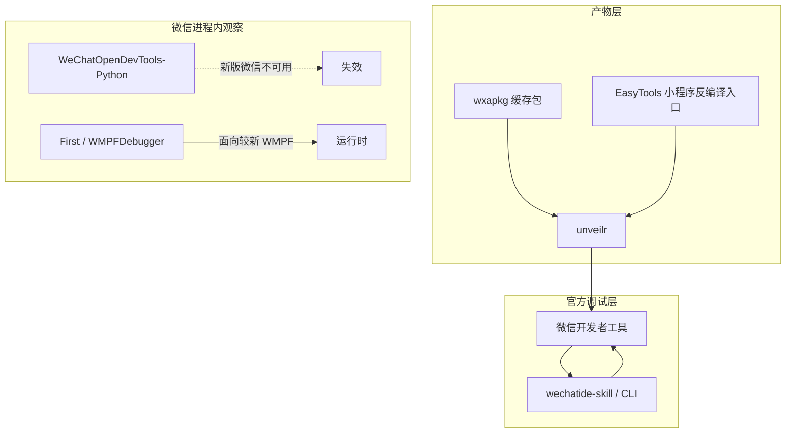

# 微信小程序工具栈：EasyTools / unveilr / OpenDevTools / First / 官方 wechatide

合法用途：在**自有应用或已获授权**的评估里，知道该用哪一层工具、哪一层已经失效。不涉及未授权访问、对他人小程序的破解或运行时注入操作步骤。

## 学了什么

把日常用的四件开源工具和官方 `wechatide-skill` 放到同一张分层图上：产物还原、授权调试、微信进程内观察、综合工作台。记录 **WeChatOpenDevTools-Python 在新版微信不可用**，以及官方 skill 的用法门禁（本仓库不安装该 skill）。

## 可复述结论

### 1. 先分层，再选工具

四层回答的问题不同：

| 层 | 问题 | 工具 |
|---|---|---|
| 产物还原 | 缓存包如何变成可阅读的工程文件 | unveilr；EasyTools 内的小程序反编译入口依赖同类能力 |
| 官方调试 | 有开发者权限时如何编译、预览、自动化、取证 | 微信开发者工具 + `wechatide` |
| 进程内观察 | 微信里跑着的小程序运行时 | 旧：OpenDevTools；新：First |
| 工作台 | 授权测试里的扫描、笔记、导航、小程序入口 | EasyTools |

它们都不能让「错误的 AppID」通过微信换票。鉴权边界见上一篇本地调试笔记。

### 2. unveilr

- 仓库：https://github.com/broken5/unveilr（fork 自 r3x5ur/unveilr 一线）
- 定位：把 `wxapkg` 还原成可查看的源码树；支持较新包格式与插件包。
- 记住：这是**产物还原**，不是登录绕过。只用于有权分析的包。

### 3. EasyTools

- 仓库：https://github.com/doki-byte/EasyTools
- 定位：授权渗透测试用的桌面工作台（工具仓库、导航、扫描、信息收集、CTF、CLI 定时等）。
- 与小程序的交点：内置小程序反编译相关能力，changelog 写明参考 unveilr。
- 交叉：Web 安全领域目前只把「这是个人工作台」记上，OWASP 模型仍未覆盖。
- 使用约束：仅授权范围；仓库自身也禁止未授权商业用途。

### 4. WeChatOpenDevTools-Python（已过时）

- 仓库：https://github.com/JaveleyQAQ/WeChatOpenDevTools-Python
- 定位：在**旧版** Windows/Mac 微信里给小程序或内置浏览器开调试界面。
- **使用者结论：新版微信不能用。** 它绑死具体微信版本与小程序内核版本，版本对不上就匹配失败。
- 图谱里保留为「旧路径 / 失效」，不要再当默认方案。不记录注入或 hook 步骤。

### 5. First

- 仓库：https://github.com/Spade-sec/First
- 定位：WMPFDebugger 二开的小程序安全研究工作台（Frida + CDP），面向较新的微信 / WMPF。
- 能力类别（只记类别）：运行时观察、wx API 观察、云函数调用观察、包还原与信息扫描、MCP 接口。
- 和 OpenDevTools 的关系：**新版微信上优先理解 First 这一层，而不是旧 Python 注入器。**
- 仅用于授权研究。不写 Frida 附加或 hook 操作手册。

### 6. 官方 wechatide-skill（只了解用法）

路径（本机已安装的开发者工具内，**不要往本仓库拷贝或再装一遍**）：

`C:\Program Files (x86)\Tencent\微信web开发者工具\resources\app.asar.unpacked\wechatide-skill`

版本阅读时为 `0.3.9`。根入口 `SKILL.md` 的要点：

- 调用形态：`wechatide -c <clientName> <toolName> ...`（Cursor 会话里 `-c Cursor`）
- **禁止在 sandbox 里跑** `wechatide`
- 业务前先 `check_wechatide_status`；`tokenRequired` 时问用户「设置 → 安全」，禁止猜 token
- 按**当前主目标**进一个 scene，不要混用原子工具

| 意图 | Scene |
|---|---|
| 安装/更新开发者工具 | installer（用户未要求安装则不要走） |
| 开窗、登录、AppID | initializer |
| 导入/列表/删除项目 | project-manager |
| 改 `project.config.json` | project-config（直接改文件） |
| 编译、刷新模拟器 | compiler |
| 预览、上传体验版 | previewer |
| 点击/输入/测试号 | automator |
| console / network / 截图 | debugger |
| 云函数/云库/云存储 | cloudbase-operator |

已实践过的 CLI 用途（清缓存、刷新、console、截图）仍记在上一篇；本篇只补 **skill 路由与门禁**。

## 实践证据

本篇为概念层：对照公开仓库说明与本机官方 skill 文档，以及「新版微信 OpenDevTools 不可用」的使用经验。未在本会话复现还原或进程内调试。

## 仍未覆盖

- 自有小程序上 automator + 测试号的完整样例
- First 在授权实验室里的实际操作记录（有工具、无本次实验）
- 小程序云开发安全（官方 skill 有 cloudbase scene，图谱仍未覆盖）
- EasyTools 各 Web 模块对应的 OWASP 知识

## 下一步

1. 授权范围内若要做运行时观察，以 First 为当前代际，OpenDevTools 仅作历史条目
2. 有开发者权限的项目继续走官方 wechatide，不要用进程内工具替代官方调试器
3. Web 安全从 EasyTools 工作台下钻到 OWASP 模型，而不是继续堆工具名
