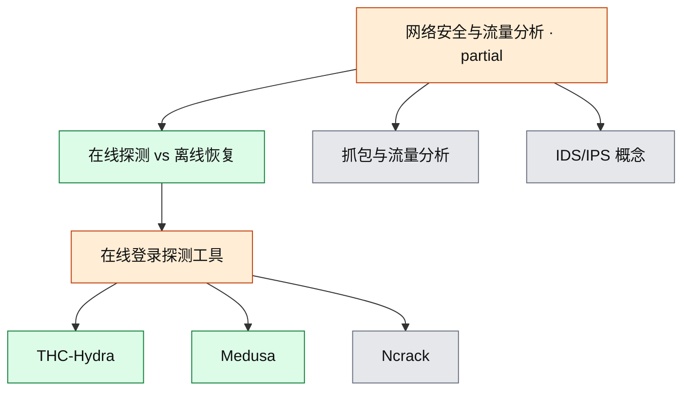

# 网络安全与流量分析

当前从**在线登录探测工具对照**切入；抓包、流量分析、IDS/IPS 尚未覆盖。深度为概念，未实践。

- 覆盖状态真源：[`coverage.yml`](../../coverage.yml)
- 本领域笔记：[learning/2026-08-17-hydra-medusa.md](learning/2026-08-17-hydra-medusa.md)

## 子图

## 已覆盖

| 节点 id | 深度 | 要点 |
|---|---|---|
| `net-online-vs-offline-auth` | concept | 在线打认证服务 vs 离线打哈希；锁定/封禁风险不同 |
| `net-login-probers` | concept | 只记授权评估用的经典工具，不收社交账号脚本；因 Ncrack 未学，父节点为 partial |
| `net-thc-hydra` | concept | fork、协议广、HTTP 表单熟、Kali 默认 |
| `net-medusa` | concept | pthread、多主机、SMB/RDP 更细、社区小 |

## 未覆盖（建议顺序）

1. 授权靶场里对 Hydra 或 Medusa 做控速观察（当前禁止把操作手册写入本库）
2. 抓包阅读（与基础网络节点交叉）
3. IDS/IPS 与流量分析
4. Ncrack、Hashcat / John（后者挂密码学，不要和本领域混）

## 与其他领域的边

- 身份认证：弱口令在线探测交叉节点 `id-weak-password-online`
- 密码学基础：仅对照到「离线哈希恢复」，Hashcat/John 本身未覆盖
- Web 安全：Hydra 的 HTTP 表单模块与 Web 弱口令评估相邻，OWASP 模型仍未覆盖
