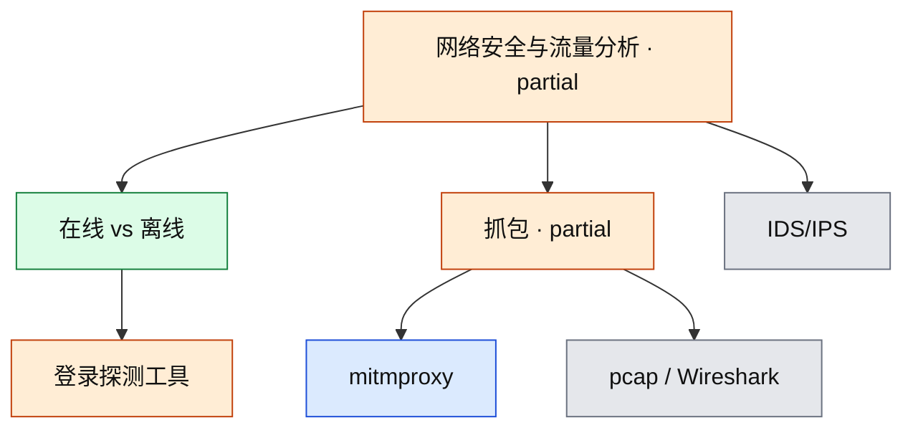

# 网络安全与流量分析

当前覆盖：在线登录探测 **Hydra/Medusa**（概念），以及 **mitmproxy 安装验证**。pcap 阅读、IDS/IPS 尚未覆盖。

- 覆盖状态真源：[`coverage.yml`](../../coverage.yml)
- 本领域笔记：
  - [learning/2026-08-17-hydra-medusa.md](learning/2026-08-17-hydra-medusa.md)
  - [learning/2026-08-16-mitmproxy.md](learning/2026-08-16-mitmproxy.md)

## 子图

## 已覆盖

| 节点 id | 深度 | 要点 |
|---|---|---|
| `net-online-vs-offline-auth` | concept | 在线打认证服务 vs 离线打哈希 |
| `net-thc-hydra` / `net-medusa` | concept | 架构与选用边界；不含探测步骤 |
| `net-mitmproxy` | practiced | 12.2.3；三条 CLI；未抓包 |

## 未覆盖（建议顺序）

1. 对本机 HTTP 站点开 mitmweb 看请求
2. pcap / Wireshark
3. IDS/IPS
4. Ncrack；Hashcat/John 挂密码学，不要和本领域混

## 与其他领域的边

- 身份认证：弱口令在线探测交叉
- 移动：UniApp / App 抓包入口
- 逆向：动态分析前后的流量观察
