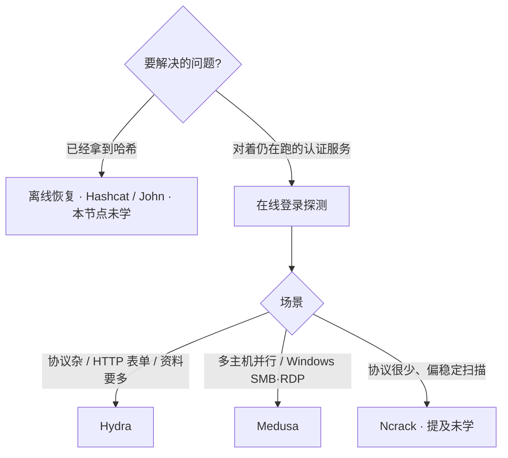

# 在线登录探测：Hydra 与 Medusa

合法用途：在**自有资产或已获授权**的评估里，理解「在线登录探测」和「离线哈希恢复」的分工，以及 Hydra / Medusa 的定位差异。本笔记只记名称、架构与选用边界，不写可复现的探测步骤、字典用法或未授权访问操作。

## 学了什么

从 GitHub 公开仓库对照两款经典在线登录探测工具：THC-Hydra 与 Foofus Medusa。同时划清它们与 Hashcat / John the Ripper 的边界，并记下 GitHub 上大量低质量「社交账号爆破」脚本不应进入工具地图。

## 可复述结论

### 1. 在线探测 ≠ 离线恢复

| 类型 | 代表 | 输入 | 风险特征 |
|---|---|---|---|
| 在线登录探测 | Hydra、Medusa | 仍在提供认证的网络服务 | 会触发锁账号、封 IP、WAF、fail2ban；并发过高可把服务打挂 |
| 离线哈希恢复 | Hashcat、John | 已经拿到的哈希 | 不打登录接口；本笔记未学这两款工具本身 |

评估弱口令前，先确认目标有无锁定与速率限制，再决定要不要用在线类工具。未授权对他人系统或账号做口令探测违法。

GitHub 搜 `password brute force` 会混进大量 Instagram / 社交账号脚本：星标低、说明夸张。高质量入口仍是 Hashcat / John / Hydra 这类长期维护项目，而不是这类账号脚本。

### 2. Hydra：协议广、资料多，默认先认它

- 仓库：https://github.com/vanhauser-thc/thc-hydra（THC / van Hauser，约 2001 年起）
- 许可：AGPLv3；当前 release 对照时为 v9.7（2026-05）
- 并发：`fork()` 子进程；模块编译进主程序
- 配套：Kali 默认、`xhydra` GTK 界面、官方 Docker、JSON 输出、会话恢复
- 覆盖面：五十多种远程认证模块，HTTP(S) 表单相对最熟；还有 LDAP、HTTP Proxy、SOCKS5、Cisco enable、SAP、SIP、MongoDB 等 Medusa 基本没有的方向
- 选用：单台或少量目标、HTTP 表单、冷门协议、需要现成教程时

作者声明仅限合法用途。

### 3. Medusa：为「多主机并行」重写，SMB/RDP 更细

- 仓库：https://github.com/jmk-foofus/medusa（Foofus / JoMo-Kun）
- 文档：https://jmk-foofus.github.io/medusa/medusa.html
- 许可：GPLv2；当前 release 对照时为 2.3（2025-05）
- 并发：`pthread` 线程，从设计起按「多主机 × 多用户 × 多口令」共享同一份列表，避免 fork 复制开销
- 模块：独立 `.mod` 文件，可单独编译加载
- 亮点不在协议数量：SMB（SMBv1，有 libsmb2 时含 SMBv2/3 与 signing）、RDP 哈希传递、部分 SNMP / AS/400 Telnet 实现更细
- 选用：一次打很多主机、很在意线程开销，或目标主要是 Windows SMB / RDP
- 代价：社区小（星标约 Hydra 的 1/14），坑要自己翻源码和 foofus 文档

作者写 Medusa 的原因：当时 Hydra 易崩、fork 模型难改。官方对比页停在 Hydra 7.1 vs Medusa 2.2，不能直接拿来评价现在的 Hydra 9.7。

### 4. 怎么选（概念层）

同类 Ncrack 定位更窄，现在不如 Hydra 常用，本节点未单独覆盖。

## 实践证据

无（概念层）。只读了仓库说明与官方文档，未在隔离环境运行这两款工具。

## 仍未覆盖

- Hydra / Medusa 在授权实验室的实操与速率控制经验
- Ncrack
- Hashcat / John 本身（仅知分工）
- 抓包、IDS/IPS、流量分析
- OAuth / 会话生命周期 / MFA（身份认证其余节点）

## 下一步

1. 若要实践：仅在自有或书面授权的隔离靶场记录「控速 + 锁定策略」观察，不要对着生产乱开并发。
2. 离线哈希线另开 Hashcat / John 节点，不要和本笔记混成同一类工具。
3. 网络领域主线仍是抓包阅读与流量分析，尚未开始。
