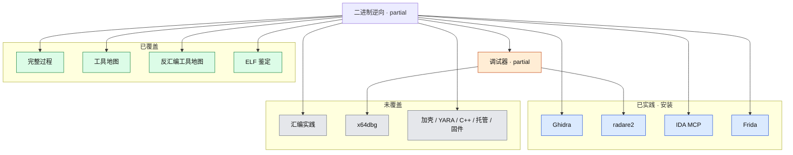

# 二进制逆向分析

过程、IOC、C/ABI、沙箱与行为差异仍是**概念**；**Ghidra / radare2 / IDA MCP / Frida** 已完成本机安装验证（未对样本做完整分析）。ELF 鉴定与 Flutter `--obfuscate` 交叉笔记在移动领域。

- 覆盖状态真源：[`coverage.yml`](../../coverage.yml)
- 本领域笔记：
  - [learning/2026-08-17-binary-reverse-engineering.md](learning/2026-08-17-binary-reverse-engineering.md)
  - [learning/2026-08-16-re-toolchain.md](learning/2026-08-16-re-toolchain.md)
- 交叉笔记：[../mobile-iot/learning/2026-08-17-android-flutter-aot.md](../mobile-iot/learning/2026-08-17-android-flutter-aot.md)

## 子图

## 已覆盖

| 节点 id | 深度 | 要点 |
|---|---|---|
| `re-process` 及实验室到报告各步 | concept | 9 步迭代 |
| `re-tools` | covered | 过程地图 + 本机已装 Ghidra/r2/IDA MCP/Frida |
| `re-disasm-catalog` | concept | 整机 vs 引擎 vs Hex；ImHex 不宜当主反汇编 |
| `re-ghidra` | practiced | 12.1.2 + JDK 21 于 `E:\tools`；未分析样本 |
| `re-radare2` | practiced | 6.2.0，`radare2 -v` |
| `re-ida-mcp` | practiced | 插件 + Cursor stdio；需重启 IDA |
| `re-frida` | practiced | CLI 17.17.0；未连设备 |
| `re-pe-elf` / `re-obfuscation` | covered | 见 Flutter 交叉笔记 |

## 未覆盖（建议顺序）

1. 自写 C 小程序，Ghidra / `analyzeHeadless` 对上 `main`
2. radare2 对同一文件做 `aaa` / 反汇编抽查（授权样本）
3. x64dbg 或 gdb 在比较处下断
4. Frida 同版本 server + 授权 App
5. 加壳、YARA、托管代码、固件

## 与其他领域的边

- 系统编程：`abi-calling-convention` 已覆盖
- 移动：Flutter AOT、UniApp 的 jadx/Apktool/Frida 交叉
- 流量：mitmproxy 与动态分析前后的流量观察交叉
