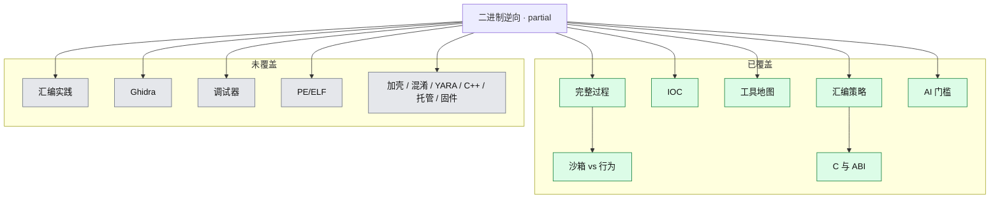

# 二进制逆向分析

第一块系统学习的领域。当前是**概念覆盖、未实践**：完整过程、IOC、工具地图、C/ABI 必要性、沙箱与行为分析差异、AI 时代门槛都已有学习记录；汇编/Ghidra/调试器等实操仍未覆盖。

- 覆盖状态真源：[`coverage.yml`](../../coverage.yml)
- 本领域笔记：[learning/2026-08-17-binary-reverse-engineering.md](learning/2026-08-17-binary-reverse-engineering.md)

## 子图

## 已覆盖

| 节点 id | 深度 | 要点 |
|---|---|---|
| `re-process` 及实验室到报告各步 | concept | 9 步迭代：目标 → 隔离 → 鉴定 → 静态属性 → 沙箱 → 行为 → 静态代码 → 动态代码 → 报告 |
| `re-sandbox` / `re-behavior` / `re-sandbox-vs-behavior` | concept | 沙箱是自动分诊；行为分析是人工核实 What |
| `re-ioc` | concept | 失陷指标；与 IOA 不同 |
| `re-tools` | concept | 每步工具名称与用途，未上手 |
| `re-assembly-strategy` | concept | 定位+抽查+验证，不是通读 |
| `re-c-abi-why` | concept | 汇编没有高级语义，C/ABI 是倒推地图 |
| `re-ai-barrier` | concept | 门槛从翻译成本转到验真、裁剪、对抗、责任 |

## 未覆盖（建议顺序）

1. C 小程序对照编译，看 `main` / 参数 / 返回值
2. x86-64 常用指令与 Windows/Linux 调用约定对照
3. PE 或 ELF 头、区段、导入表（用自己的程序）
4. Ghidra 打开上述程序，对上源码
5. 调试器在比较/输出处下断点
6. 再考虑教学样本、YARA、混淆等

## 与其他领域的边

- 系统编程：`abi-calling-convention` 已覆盖，C 语言本身未覆盖
- 威胁情报：IOC/IOA 概念已覆盖
- 应急响应：NIST 四阶段仅作为外层框架提及
- 恶意软件分析：相邻但未单列学习
