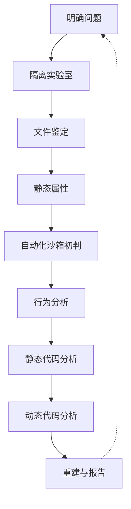
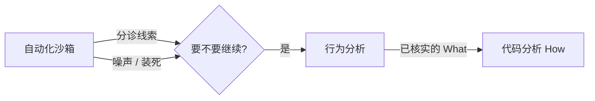

# 二进制逆向：过程、IOC、工具、C/ABI，以及 AI 之后的门槛

合法用途：恶意软件研判、事故响应、漏洞审计、协议互操作。不涉及破解、绕过授权或编写利用。

## 学了什么

一次对话把「二进制逆向的完整过程」讲清楚，并追问了四个概念缺口：IOC、每步工具与是否硬读汇编、为何要学 C/ABI、自动化沙箱与行为分析有何不同。另外讨论了 AI 普及后逆向门槛会挪到哪里。

## 可复述结论

### 1. 外层是取证，内层是迭代分析

外层可套 NIST SP 800-86：**采集 → 检验 → 分析 → 报告**。  
内层接近 SANS / Zeltser 的恶意软件方法，在隔离实验室里把静态属性、行为、代码分析反复做，直到回答完事先写下的问题。

目标决定深度。应急响应常常做到行为 + IOC 就够；深度研判才需要还原算法。

### 2. 九步过程（可循环）

1. **明确问题**：是不是恶意、改了什么、连谁、某个异常对应哪段逻辑。
2. **隔离实验室**：虚拟机快照、与生产网隔离、样本只读、记录哈希。
3. **文件鉴定**：PE/ELF/Mach-O、架构位数、是否像加壳、编译语言、签名。这步决定工具链。
4. **静态属性（不运行）**：字符串、导入表、资源、熵值、哈希情报。形成假说，不是结论。
5. **自动化沙箱初判**：短时间自动跑，看文件/进程/网络/持久化。噪声大、会被反沙箱骗，是**起点**。
6. **行为分析**：在自己实验室里监控文件系统、注册表、进程、网络、IPC。回答 **What**，产出可核实的 IOC 和清理建议。
7. **静态代码分析**：反汇编/反编译，从入口、字符串 xref、API 定位关键函数，还原控制流和数据结构。
8. **动态代码分析**：调试器验证运行时数据；在关键 API 或比较处下断点，而不是从入口单步到结束。
9. **重建与报告**：功能清单（已证实 / 仅静态可见 / 未触发）、IOC、防御建议；写清事实与推断。

教学例子：自写的口令比较小程序。鉴定看到 ELF/PE；字符串窗口可能直接出现提示语和明文；行为上无落盘无联网；反编译能还原 `strcmp`；若字符串被简单变换，则在比较处下断看缓冲区。

### 3. 沙箱初判 ≠ 行为分析

两者观察对象重叠（文件、进程、网络），差别不在软件名字，而在约束：

| | 自动化沙箱 | 行为分析 |
|---|---|---|
| 谁跑 | 固定剧本、追求吞吐 | 分析员在场、可改条件 |
| 目的 | 分诊：要不要继续、先盯哪 | 取证：本次运行确实做了什么 |
| 输出 | 线索 | 可复述的 What |

同一条「写了 `%TEMP%\svc.dat`」在沙箱里是提示；在行为分析里要有路径、哈希、进程树、是否依赖网络，才能写进报告。  
How 仍然留给代码分析。

### 4. IOC 是什么

**IOC（Indicator of Compromise，失陷指标）**：用来判断主机或流量是否已被攻陷过的可观测线索。例如文件哈希、路径、互斥体、域名、注册表键。

它回答「怎么认出它来过」，不回答「怎么打进去」。  
**IOA** 更偏手法（例如用合法工具写启动项），不绑死某一个哈希。  
YARA / Sigma 是把线索写成可检索规则。

### 5. 每步工具（名称与用途）与汇编策略

| 步骤 | 工具（记名称即可） |
|---|---|
| 隔离 | VirtualBox / VMware / Hyper-V |
| 鉴定 | `file`、Detect It Easy、CFF Explorer、PE-bear、`readelf` |
| 静态属性 | `strings`、FLOSS、pestudio |
| 沙箱 | ANY.RUN、CAPE、Cuckoo、Joe Sandbox |
| 行为 | Process Monitor、Process Explorer、Wireshark、Sysmon |
| 静态代码 | Ghidra、IDA、Binary Ninja、radare2 |
| 动态代码 | x64dbg、WinDbg、gdb/gef |
| 托管代码 | dnSpy、JADX |

**不必通读汇编，但不能完全不碰。** 工作方式是三层：先用反编译和字符串定位；伪代码说谎或空白时下到汇编；调试用来验证而不是朗读全文。常规样本大致是 70% 属性+行为+伪代码，20% 对照几段汇编，10% 真正逐条抠。

### 6. 为什么要熟练 C，以及 ABI / 调用约定

二进制不是另一种源码，而是 **C（或类 C）编译后剩下的机器约定**。汇编没有「函数」「对象」这些词；它们是编译器和 ABI 约定出来的。

- **C**：`if` 是比较+条件跳；局部变量是栈槽；`struct` 是按对齐排的内存。逆向是把「源码 → 汇编」倒着走。Ghidra 伪代码像 C，正是因为这个心智模型。
- **ABI / 调用约定**：参数放哪个寄存器、谁清栈、返回值在哪、栈如何对齐、结构体怎么传。Windows x64 前四个整数/指针走 `RCX, RDX, R8, R9`；Linux System V 走 `RDI, RSI, RDX, RCX, R8, R9`。不懂就会把参数当成局部变量，或看错结构体字段。

工具负责把字节变成汇编或伪代码；C 解释程序结构；ABI 解释函数边界上的数据放在哪。有了它们，才能判断模型或反编译器有没有说错。

### 7. AI 之后门槛在哪

机械步骤（改名、摘要、对已知家族、写草稿）会变便宜；动态调试也会逐渐被 agent + 执行反馈补上。门槛不消失，而是搬家：

1. **验真**：模型会把反编译伪影推理成很自信的错误结论。以后差的是「AI 说这是 C2」；好的是能钉到地址、交叉工具、运行时数据。
2. **提问与裁剪**：模型吃不下整个二进制。选错函数，后面全是精致幻觉。
3. **对抗**：样本会专门骗分析器（混淆、自定义 VM、污染字符串）。
4. **环境耦合**：C2 是否活着、是否要特定域环境才爆发，不在静态文本里。
5. **领域深度**：自研协议、密码误用、内核/固件，比「解释这段伪代码」更稀缺。
6. **责任**：报告上要签字的是人，事实/推断/未知必须分开。

汇编和 C 仍然要学，理由变了：不是因为 AI 读不了，而是因为只有你懂，才能看出它在流畅地撒谎。

## 实践证据

无。全程概念层，未打开样本、未使用 Ghidra 或调试器。

## 仍未覆盖

- x86-64 汇编动手
- PE / ELF 格式深入
- Ghidra、x64dbg / gdb 实操
- 加壳识别、混淆、YARA
- C++ / 托管代码 / 固件
- 恶意软件教学样本（需隔离实验室）

## 下一步

用自己写的小 C 程序（例如带 `strcmp` 的输入检查）编译后，在 Ghidra 里对上 `main` 和参数寄存器，验证本笔记里的 ABI 说法。
