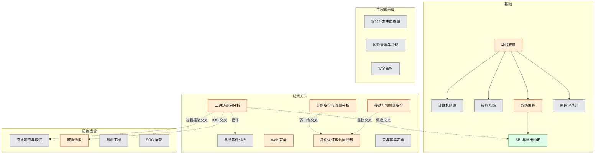
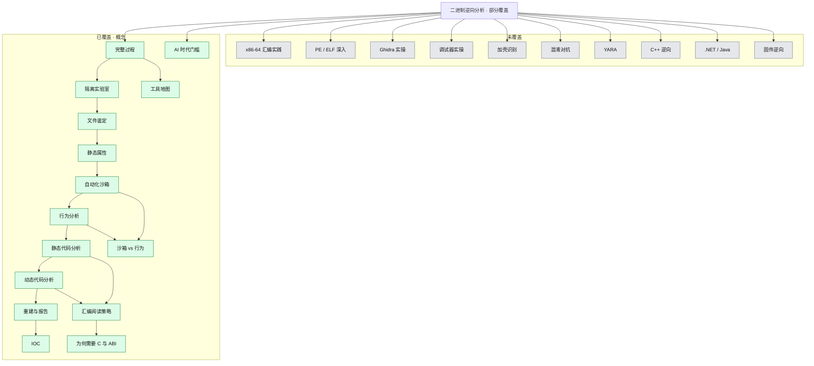
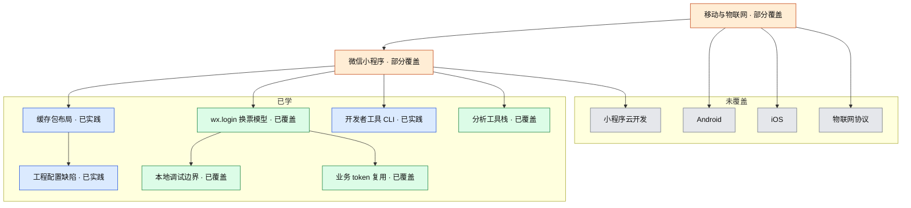
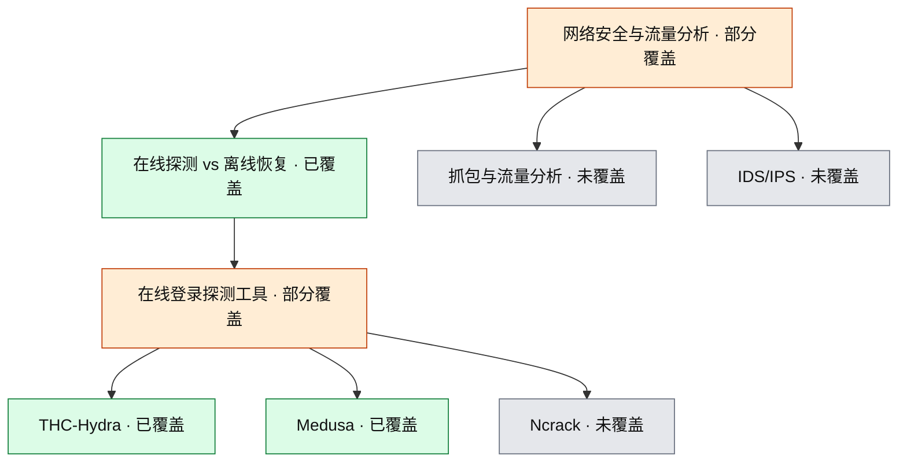

# 知识图谱

状态以 [`coverage.yml`](coverage.yml) 为准。更新方式见 [`AGENTS.md`](AGENTS.md)。

图例：灰 = 未覆盖 · 橙 = 部分覆盖 · 绿 = 已覆盖（概念） · 蓝 = 已实践

最后同步：2026-08-17

## 顶层领域

## 二进制逆向分析（当前主领域之一）

## 移动与物联网安全（微信小程序）

## 网络安全与流量分析（在线登录探测）

## 覆盖一览

| 领域 | 状态 | 学习记录 |
|---|---|---|
| 基础底座 / 网络、OS、密码学 | 部分覆盖（仅 ABI 已覆盖） | [2026-08-17 逆向](domains/reverse-engineering/learning/2026-08-17-binary-reverse-engineering.md) |
| 系统编程 / ABI 与调用约定 | 部分 / ABI 已覆盖 | 同上 |
| **二进制逆向分析** | **部分覆盖** | 同上 |
| **移动与物联网安全** | **部分覆盖** | [2026-08-17 小程序](domains/mobile-iot/learning/2026-08-17-wechat-miniprogram-local-debug.md) · [工具栈](domains/mobile-iot/learning/2026-08-17-wechat-mp-tooling.md) |
| **身份认证与访问控制** | **部分覆盖**（小程序登录 + 弱口令在线探测交叉） | [小程序本地调试](domains/mobile-iot/learning/2026-08-17-wechat-miniprogram-local-debug.md) · [Hydra/Medusa](domains/network-security/learning/2026-08-17-hydra-medusa.md) |
| 恶意软件分析 | 未覆盖 | — |
| Web 安全 | 部分覆盖（仅 EasyTools 定位） | [工具栈](domains/mobile-iot/learning/2026-08-17-wechat-mp-tooling.md) |
| **网络安全与流量分析** | **部分覆盖**（Hydra/Medusa 概念） | [2026-08-17 Hydra/Medusa](domains/network-security/learning/2026-08-17-hydra-medusa.md) |
| 云与容器安全 | 未覆盖 | — |
| 应急响应与取证 | 未覆盖 | 过程框架仅在逆向中提及 |
| 威胁情报 | 部分覆盖（IOC/IOA） | 逆向笔记 |
| 检测工程 | 未覆盖 | — |
| SOC 运营 | 未覆盖 | — |
| 安全开发生命周期 | 未覆盖 | — |
| 风险管理与合规 | 未覆盖 | — |
| 安全架构 | 未覆盖 | — |
