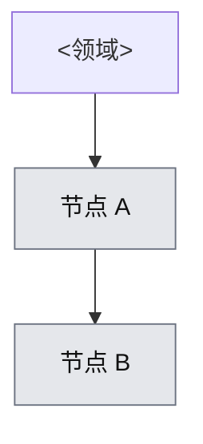

# <领域中文名>

- 覆盖状态：`uncovered` | `partial` | `covered` | `practiced`
- 状态真源：[`coverage.yml`](../../coverage.yml)
- 学习总账：[`LEARNING_LOG.md`](../../progress/LEARNING_LOG.md)

## 子图

## 已覆盖

| 节点 id | 深度 | 学习记录 |
|---|---|---|
| — | — | — |

## 未覆盖（下一步）

- ...

## 与其他领域的边
